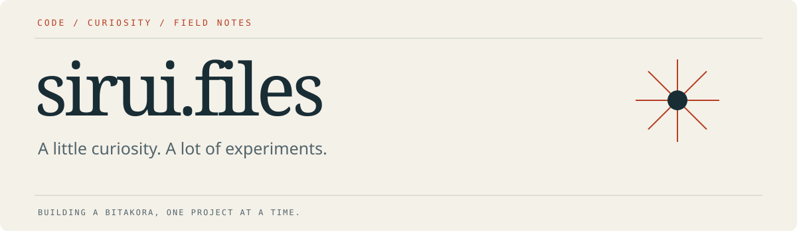

<b>A bitakora of code, experiments, and things worth figuring out.</b>

### Currently exploring

Computer vision, deep learning, and the small surprises that appear when a model meets the real world. I like turning experiments into visual explanations that are easy to follow.

| Learning | Making | Wondering |
| :--- | :--- | :--- |
| How CNNs recognize patterns | Clear notebooks and visual project guides | When should an AI ask for help? |

### A recent field note

**A handwritten 7 became a 2.** A small CNN performed well on MNIST, then stumbled on a personal handwriting style. That mistake became a closer look at preprocessing, uncertainty, and what test accuracy does and does not tell us.

### Elsewhere in the collection

[**gym2go-detect →**](https://github.com/Sirui-ii/gym2go-detect)

Learn it. Build it. Look closer.
